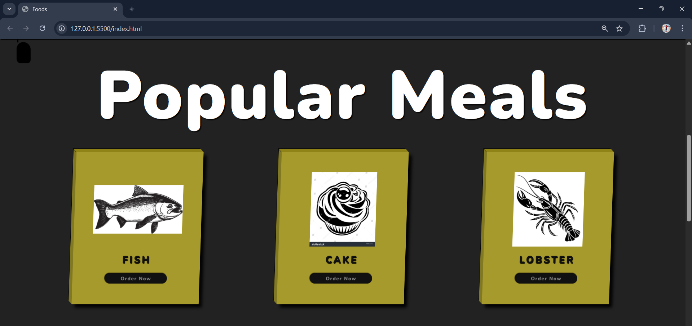
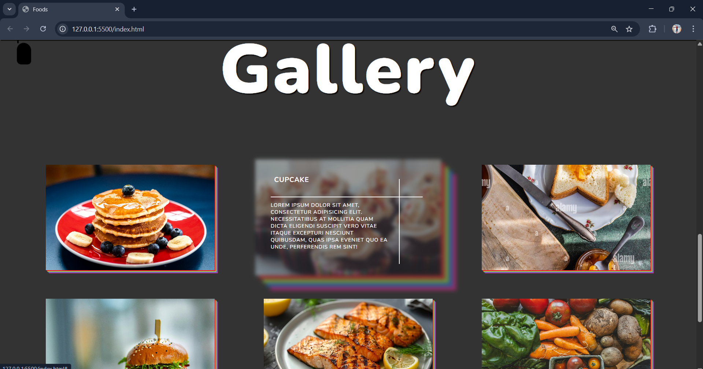
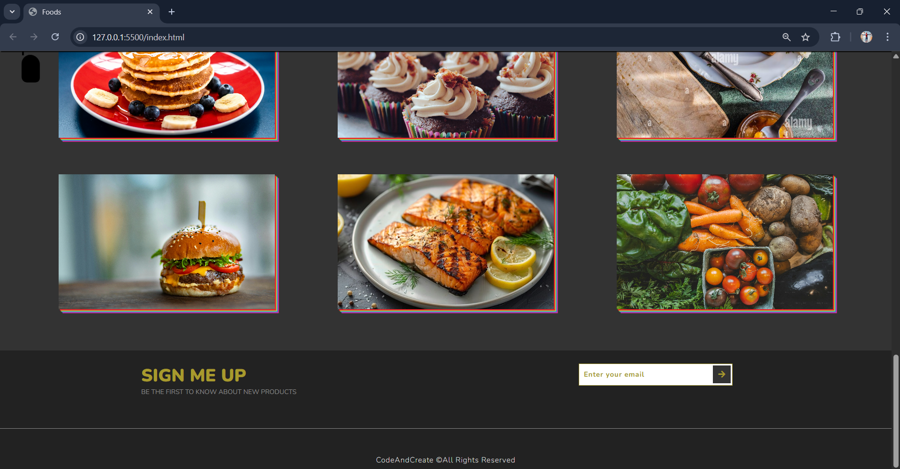

##🍔 Foodie-hub
Delicious Foods - A modern, responsive food showcase website featuring animated navigation, rotating food icons, interactive meal cards, and a beautiful food gallery with smooth animations and hover effects.

##Sceenshots

##✨ Features
-Animated navbar with menu toggle
-Hero section with rotating food icons
-Popular meals cards with hover effects
-Food gallery with colorful shadows and animations
-Email signup section
-Fully responsive design for all devices

##🛠️ Technologies Used
-HTML5
-CSS3
-JavaScript
-Font Awesome (Icons)
-Google Fonts (Nunito)

## 📁 Project Structure
Foodie-hub/
├── index.html
├── style.css
├── script.js
└── images/
    ├── burger.jpg
    ├── cupcake.jpeg
    ├── grilled.jpg
    ├── pancake.jpeg
    ├── sandwich.jpg
    ├── vegetables.jpeg

